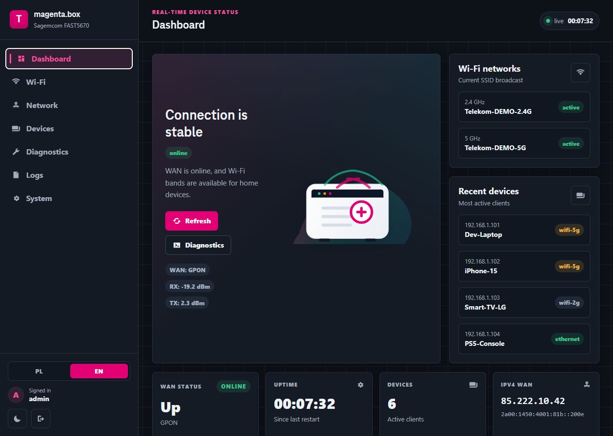
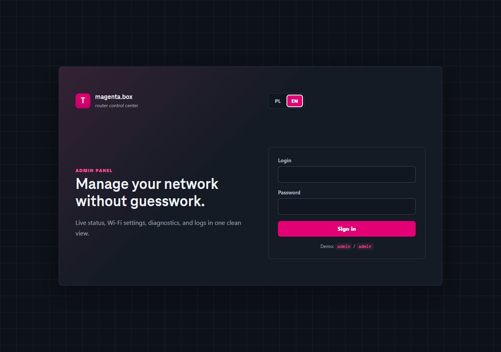
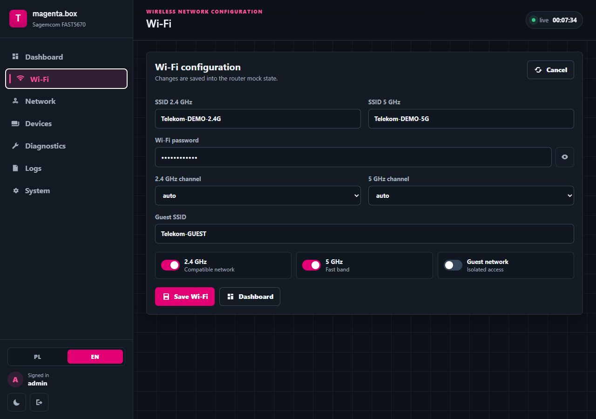
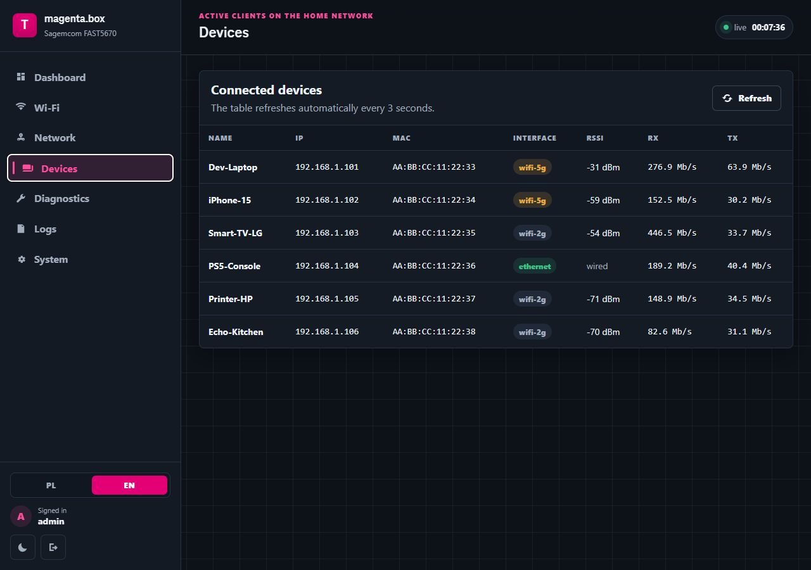
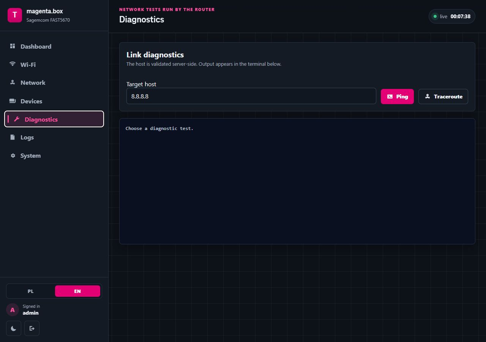
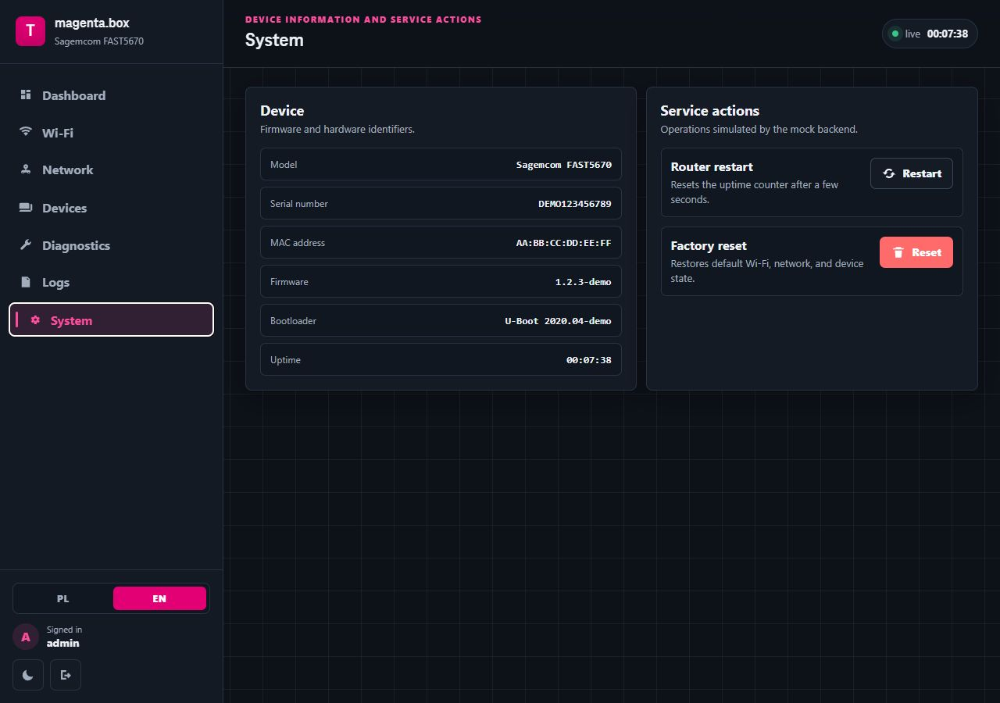

# magenta.box — Telekom Router Demo

> 🇵🇱 [Polska wersja](./README.md) · 🇬🇧 English (this file)

> ⚠️ **Educational, non-commercial demo.** See [Disclaimer & Legal](#disclaimer--legal) below.

A fully working, locally-runnable demo of a Telekom / T-Mobile router (RDK-B / CCSP)
management panel. It ships in three layers:

1. **Original landing page** (`/`) — verbatim frontend from the operator's firmware
   (PL / CZ / GR / …), backed by a mocked TR-181-like API.
2. **Custom admin panel** (`/admin/`) — a from-scratch SPA in plain JS/CSS,
   Magenta theme, dark mode, mobile drawer, live updates via SSE.
3. **Two interchangeable backends** — a lightweight stdlib one (`mock_server.py`)
   and a full FastAPI one (`backend/`) with SQLite, JWT, bcrypt and a pub/sub
   event hub.

| | Landing `/` | Admin `/admin/` |
|---|---|---|
| Frontend | jQuery + tmpl.js (Telekom original) | vanilla JS, custom CSS, TeleNeo |
| Auth | none (read-only) | login `admin` / `admin`, session cookie |
| Live update | 5 s polling | SSE `/api/stream` (event-hub pub/sub) |
| State mutation | no | Wi-Fi, network, restart, factory reset |



---

## Disclaimer & Legal

**This repository is an educational, non-commercial demonstration project.**

- **"Telekom"**, **"T-Mobile"**, **"Cosmote"**, **"Magenta"** and **"magenta.box"**
  are registered trademarks of **Deutsche Telekom AG** and its affiliates. Use
  here is strictly **nominative** (referring to the product being mocked) — no
  affiliation, sponsorship or endorsement is implied.
- The original landing page assets (`index.html`, `CSS/style.css`,
  `CSS/common.css`, `JS/index.js`, `JS/translator.js`, `JS/utility.js`,
  `*PopUp.html`, `open_source_license.html`, `languages/*.json`) and the
  **TeleNeo Web font** (`CSS/fonts/TeleNeoWeb-*.woff2`) are property of
  **Deutsche Telekom AG**. They are included **solely** to demonstrate that
  the mock backend renders the original UI correctly.

**Rights holders**: If you are a representative of Deutsche Telekom AG (or any
affiliate) and want any content removed, please open a GitHub issue or send a
DMCA notice to GitHub — I will comply within 24 hours.

---

## Table of contents

- [Requirements](#requirements)
- [Quick start](#quick-start)
- [Choosing a backend](#choosing-a-backend)
- [API endpoints](#api-endpoints)
- [Admin panel features](#admin-panel-features)
- [Repository layout](#repository-layout)
- [State persistence](#state-persistence)
- [Extending](#extending)
- [Security](#security)
- [License](#license)

---

## Requirements

- **Python 3.10+** (tested on 3.11, 3.12, 3.14)
- `pip` and `venv` (Debian/Ubuntu: `sudo apt install python3-venv python3-pip`)
- Optionally `iputils-ping` and `traceroute` for the diagnostics view:

  ```bash
  sudo apt install iputils-ping traceroute    # Debian / Ubuntu
  sudo dnf install iputils traceroute         # Fedora / RHEL
  sudo pacman -S iputils traceroute           # Arch
  ```

  Without these the diagnostics panel will show `command not found` — the rest
  of the app still works.

---

## Quick start

### Option A — stdlib (zero dependencies)

```bash
python3 mock_server.py            # port 8000
python3 mock_server.py 9000       # custom port
```

### Option B — FastAPI (full database backend)

```bash
python3 -m venv .venv
source .venv/bin/activate
pip install -r requirements.txt
uvicorn backend.main:app --reload --port 8000
```

<details>
<summary>Windows PowerShell — click to expand</summary>

```powershell
py -3 -m venv .venv
.\.venv\Scripts\Activate.ps1
pip install -r requirements.txt
uvicorn backend.main:app --reload --port 8000
```

</details>

Once running (either variant), open:

| URL | What it does |
|---|---|
| <http://127.0.0.1:8000/>           | Router landing page (Telekom original) |
| <http://127.0.0.1:8000/admin/>     | Admin panel — login `admin` / `admin` |
| <http://127.0.0.1:8000/api/stream> | SSE stream — `event: tick`, `event: logs` |

Switching the landing page's country variant (theme + branding):

```
?partner=telekom-pl   (default)
?partner=telekom-cz | telekom-sk | telekom-hr | telekom-hu
?partner=telekom-gr   (Cosmote)
?partner=telekom-me | telekom-mk
```

### systemd service (optional, for option B)

If you want to run the backend as a service, drop
`/etc/systemd/system/magenta-box.service`:

```ini
[Unit]
Description=magenta.box router demo
After=network.target

[Service]
Type=simple
User=awski
WorkingDirectory=/home/awski/magenta-box
Environment="PATH=/home/awski/magenta-box/.venv/bin"
EnvironmentFile=-/home/awski/magenta-box/.env
ExecStart=/home/awski/magenta-box/.venv/bin/uvicorn backend.main:app --host 127.0.0.1 --port 8000
Restart=on-failure

[Install]
WantedBy=multi-user.target
```

```bash
sudo systemctl daemon-reload
sudo systemctl enable --now magenta-box
sudo systemctl status magenta-box
journalctl -u magenta-box -f
```

---

## Choosing a backend

| Criterion | `mock_server.py` (stdlib) | `backend/` (FastAPI) |
|---|---|---|
| Dependencies | none | `requirements.txt` (FastAPI, SQLAlchemy, sse-starlette, bcrypt, PyJWT, …) |
| Persistence | `state.json` in the root | SQLite (`router.db` in the root) |
| Auth | in-memory session, token in cookie | JWT (HS256, PyJWT) in HttpOnly cookie + native bcrypt |
| Simulator | background thread (`threading`) | async task (`asyncio`) |
| SSE | inline per-client loop in handler | `sse-starlette` + `EventHub` (pub/sub to many subscribers) |
| Diagnostics (`ping`/`traceroute`) | blocking `subprocess.run` | `asyncio.create_subprocess_exec` + kill on timeout |
| Lifecycle | main thread until Ctrl-C | `lifespan` context (proper startup + shutdown) |
| Hot reload | no | `uvicorn --reload` |

Both backends serve the **same** `admin/` SPA and `index.html` landing page,
so they're freely interchangeable.

---

## API endpoints

### Public (landing) — no auth

| Method | Path | Returns |
|---|---|---|
| GET | `/api/getRouterStatus`    | `partner_id`, `internetStatus`, `wifi_ssid`, `ipAdd`, … |
| GET | `/api/getUpgradeStatus`   | `{ upgradeStatus: false }` |
| GET | `/api/getDeviceInfo`      | model, serial, MAC, firmware, uptime |
| GET | `/api/getNetworkInfo`     | DNS, public IPv4/IPv6, LAN CIDR |
| GET | `/api/getPPPOEInfo`       | `pppoe_status`, alias, `last_status_change` |
| GET | `/api/getWanType`         | GPON/DSL link, RX/TX signal, throughput |
| GET | `/api/getEUTelephoneInfo` | phone numbers (Greek variant) |

### Auth

| Method | Path | Body / Effect |
|---|---|---|
| GET  | `/api/auth/me`     | `{ authenticated, user }` |
| POST | `/api/auth/login`  | `{ username, password }` → sets `session=` cookie |
| POST | `/api/auth/logout` | clears the cookie |

### Admin (session required)

| Method | Path | What it does |
|---|---|---|
| GET  | `/api/admin/summary`                | snapshot: WAN, Wi-Fi, throughput, devices_count, uptime |
| GET/POST | `/api/admin/wifi`               | 2.4G/5G/guest config (SSID, password, channel, on/off) |
| GET/POST | `/api/admin/network`            | LAN IP, subnet, DHCP range, DNS |
| GET  | `/api/admin/devices`                | client list (drifts every 2–5 s) |
| GET  | `/api/admin/system`                 | model, serial, firmware, MAC, uptime |
| GET  | `/api/admin/logs`                   | last 200 entries |
| POST | `/api/admin/restart`                | resets uptime after 6 s |
| POST | `/api/admin/factory_reset`          | drops the DB / overwrites state.json |
| POST | `/api/admin/diagnostics/ping`       | `{ host }` → real `ping` (regex-whitelisted host) |
| POST | `/api/admin/diagnostics/traceroute` | `{ host }` → `traceroute` / `tracert` |

Quick test with curl:

```bash
# store session cookie
curl -c /tmp/mb.cookies -X POST http://127.0.0.1:8000/api/auth/login \
  -H "Content-Type: application/json" \
  -d '{"username":"admin","password":"admin"}'

# use the cookie for admin calls
curl -b /tmp/mb.cookies http://127.0.0.1:8000/api/admin/summary | jq

# SSE — tick + log stream
curl -N -b /tmp/mb.cookies http://127.0.0.1:8000/api/stream
```

### SSE

`GET /api/stream` — event stream:

```
event: tick
data: { uptime, wan, wifi, throughput, devices_count, system, ts }

event: logs
data: [ { ts, level, msg }, ... ]
```

In the FastAPI variant the stream is fan-out via `EventHub`
(`backend/event_hub.py`) — the simulator publishes once and every connected
subscriber receives the same payload.

---

## Admin panel features

| View | What's there |
|---|---|
| **Dashboard** | router hero graphic (`router-panel.svg`), 4 tiles (WAN status, uptime, devices, IPv4), RX/TX sparklines (30 samples), Wi-Fi bands, top-4 device preview |
| **Wi-Fi**     | 2.4/5G SSID, password show/hide toggle, channel select, on/off switches (2.4 / 5 / guest), guest SSID |
| **Network**   | LAN IP/subnet, DHCP range, primary/secondary DNS |
| **Devices**   | 7-column table (name, IP, MAC, iface, RSSI, RX, TX), auto-refresh every 3 s |
| **Diagnostics** | host input + `Ping` / `Traceroute`, dark terminal output |
| **Logs**      | live tail over SSE, per-level colouring (`info`/`warn`/`error`), auto-scroll, clear-view button |
| **System**    | device info + service actions (restart, factory reset with `confirm()`) |

Additionally:

- **Dark mode** — toggle in the sidebar footer, persisted in `localStorage`.
- **Mobile drawer** — sidebar collapses to a drawer + scrim below 900 px.
- **Toasts** — `toast()` in the bottom-right, with in/out animation.
- **XSS-safe** — every API value goes into the DOM through `escapeHTML(...)`.
- **Icons** — single inline SVGs embedded in CSS as `mask-image` (zero
  external dependencies, coloured via `currentColor`).

### Screenshots

| | |
|---|---|
| **Login** — dark, minimal, branded | **Dashboard** — hero, tiles, sparklines, top devices |
|  |  |
| **Wi-Fi** — 2.4G / 5G / guest config | **Devices** — live client list |
|  |  |
| **Diagnostics** — ping / traceroute terminal | **System** — info & service actions |
|  |  |

---

## Repository layout

```
magenta-box/
├── index.html                         # Original Telekom landing (see Disclaimer)
├── open_source_license.html           # Open Source modal (Telekom)
├── restartPopUp.html                  # Restart modal (idle)
├── restartUpgradePopUp.html           # Restart modal (during upgrade)
├── resetPopUp.html                    # Factory reset modal (idle)
├── resetUpgradePopUp.html             # Factory reset modal (during upgrade)
│
├── CSS/                               # Original Telekom styles (see Disclaimer)
│   ├── bootstrap.min.css
│   ├── common.css
│   ├── style.css
│   └── fonts/                         # TeleNeo Web (© Deutsche Telekom AG)
│
├── JS/                                # Original Telekom scripts (see Disclaimer)
│   ├── jquery.min.js
│   ├── bootstrap.min.js
│   ├── tmpl.js
│   ├── translator.js
│   ├── utility.js
│   └── index.js
│
├── languages/
│   ├── index.json                     # List of language files
│   ├── pl.json
│   └── en_pl.json
│
├── admin/                             # ⭐ Custom admin panel (SPA) — MIT
│   ├── index.html                     # Shell + login screen
│   ├── admin.css                      # Custom CSS (Magenta theme, dark mode, mobile)
│   ├── admin.js                       # Vanilla JS view router, SSE client, fetch API
│   └── router-panel.svg               # Hero graphic in the dashboard
│
├── mock_server.py                     # ⭐ Backend #1 — stdlib (zero deps) — MIT
├── state.json                         # State persisted by mock_server.py (gitignored)
│
├── backend/                           # ⭐ Backend #2 — FastAPI — MIT
│   ├── main.py                        # FastAPI app, lifespan, static mounts, SSE endpoint
│   ├── config.py                      # pydantic-settings (.env support)
│   ├── database.py                    # async SQLAlchemy + sessionmaker
│   ├── models.py                      # User, WifiConfig, NetworkConfig, SystemInfo,
│   │                                  # WanStatus, Device, Log
│   ├── schemas.py                     # Pydantic schemas
│   ├── crud.py                        # init_db (seeds), get/update helpers
│   ├── auth.py                        # PyJWT (HS256) + native bcrypt
│   ├── event_hub.py                   # In-process pub/sub for SSE
│   ├── simulator.py                   # Async task: drift devices, publish events
│   └── routers/
│       ├── public.py                  # Legacy /api/get* (landing)
│       ├── auth.py                    # /api/auth/{me,login,logout}
│       └── admin.py                   # /api/admin/*
│
├── requirements.txt                   # For option B (FastAPI)
├── router.db                          # SQLite — auto-created (gitignored)
│
├── screenshots/                        # Screenshots used by the READMEs
│   ├── admin-en-login.png
│   ├── admin-en-dashboard.png
│   ├── admin-en-wifi.png
│   ├── admin-en-devices.png
│   ├── admin-en-diagnostics.png
│   └── admin-en-system.png
│
├── LICENSE                            # MIT — scoped to original code only
├── README.md                          # Polish README
└── README.en.md                       # this file
```

⭐ = original work, MIT.  
Everything else — see [Disclaimer & Legal](#disclaimer--legal).

---

## State persistence

### `mock_server.py`

State is kept in **`state.json`** in the project root, written on every
mutation. Logs are volatile (reset on restart).

### `backend/`

State lives in **`router.db`** (SQLite via aiosqlite). Tables are created at
startup (`models.Base.metadata.create_all`). Seed data is inserted by
`crud.init_db()` (admin user, default Wi-Fi, network, system info, WAN, 6
devices).

Reset the database:

```bash
rm -f router.db
# next start re-creates the schema + seed
```

Configuration via `.env` (next to `backend/`):

```bash
cat > .env <<'EOF'
DATABASE_URL=sqlite+aiosqlite:///./router.db
JWT_SECRET=$(openssl rand -hex 32)
JWT_EXPIRE_MINUTES=60
EOF
```

---

## Extending

### Adding a new view to the admin SPA

Edit `admin/admin.js`:

1. Add an entry to `viewMeta` (title, subtitle).
2. Add a key to the `views` object with `render()` (returns an HTML string)
   and `onMount()` (called after insertion into the DOM).
3. Add a `<button class="nav-item" data-view="...">` to `admin/index.html`.

### A new backend endpoint

- **stdlib**: add an `if path == ...` branch in `Handler.do_GET` or
  `do_POST` (`mock_server.py`).
- **FastAPI**: add a router handler in `backend/routers/<file>.py`; if it
  requires a session, depend on `Depends(get_current_user)`.

### Additional landing-page languages

Drop a `languages/<lang>.json` and register it in `languages/index.json`.
The translator (`JS/translator.js`) picks the first match for
`navigator.language`.

---

## Security

This is a **local demo**, not production. In particular:

- The default `admin` password is hard-coded in `crud.init_db()` /
  `mock_server.DEFAULT_STATE`.
- `JWT_SECRET` has a fallback of `super-secret-key-for-router-demo` —
  override it via `.env` before exposing anything to a network. Generate a
  proper one with `openssl rand -hex 32`.
- The session cookie is `SameSite=Lax`, `HttpOnly`, but **not** `Secure`
  (because of HTTP localhost). For HTTPS, set `secure=True` in
  `response.set_cookie(...)`.
- Diagnostics actually executes `ping`/`traceroute` server-side. The host
  whitelist is the regex `^[A-Za-z0-9.\-:]{1,100}$` — don't expose this
  endpoint publicly without further restrictions.
- CORS is not configured — the backend assumes same-origin.

By default it binds to `127.0.0.1`. To expose beyond localhost, use
`uvicorn --host 0.0.0.0` or change the bind in `mock_server.py`. **Fix the
points above first.**

nginx reverse proxy for option B:

```nginx
location / {
    proxy_pass http://127.0.0.1:8000;
    proxy_set_header Host $host;
    proxy_set_header X-Real-IP $remote_addr;
    proxy_set_header X-Forwarded-For $proxy_add_x_forwarded_for;
    proxy_set_header X-Forwarded-Proto $scheme;
}
location /api/stream {
    proxy_pass http://127.0.0.1:8000;
    proxy_http_version 1.1;
    proxy_set_header Connection "";
    proxy_buffering off;
    proxy_read_timeout 24h;
}
```

---

## Stack & acknowledgments

**Original code** (MIT, © 2026 Awski):

- FastAPI backend (`backend/`) — async SQLAlchemy + PyJWT + bcrypt + sse-starlette
- stdlib backend (`mock_server.py`) — pure Python standard library
- Admin SPA (`admin/`) — vanilla JS + custom CSS, ~2000 lines, zero
  frontend dependencies

**Open-source dependencies** (FastAPI variant):

- [FastAPI](https://fastapi.tiangolo.com/) (MIT) · [Starlette](https://www.starlette.io/) (BSD) · [SQLAlchemy](https://www.sqlalchemy.org/) (MIT)
- [Pydantic](https://docs.pydantic.dev/) (MIT) · [PyJWT](https://pyjwt.readthedocs.io/) (MIT) · [bcrypt](https://github.com/pyca/bcrypt/) (Apache 2.0)
- [sse-starlette](https://github.com/sysid/sse-starlette) (BSD) · [aiosqlite](https://github.com/omnilib/aiosqlite) (MIT) · [uvicorn](https://www.uvicorn.org/) (BSD)

**Landing-page third-party (in the original UI)**:

- jQuery, Bootstrap 3, JavaScript Templates (`tmpl.js`) — MIT

---

## License

All original code written specifically for this project (`admin/`, `backend/`,
`mock_server.py`, simulator code and custom SVG assets) is © 2026 Awski and
licensed under the **MIT License** — see [`LICENSE`](./LICENSE) for the full
text and exact scope.

Third-party Telekom / T-Mobile assets (the landing page, TeleNeo fonts,
trademarks, branding) are **not** covered by this license and remain the
property of their respective rights holders. See
[Disclaimer & Legal](#disclaimer--legal) for the rights-holder contact procedure.

Vendored open-source libraries (jQuery, Bootstrap, tmpl.js, …) retain their
original MIT licenses.

---

## Contact

Questions, suggestions, PRs welcome. Issues / DMCA notice:
<https://github.com/Awskiszef/magenta-box/issues>
