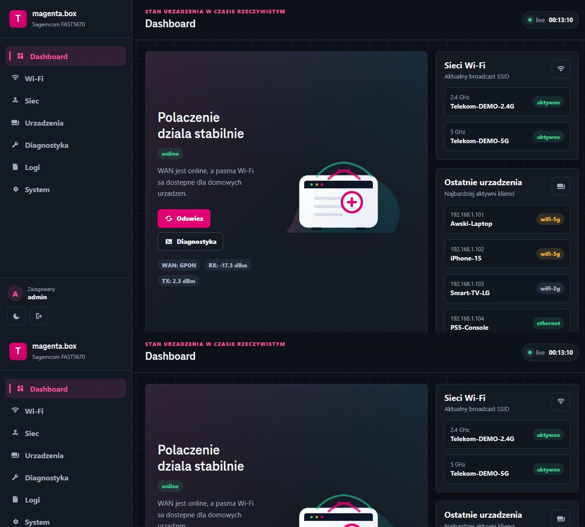
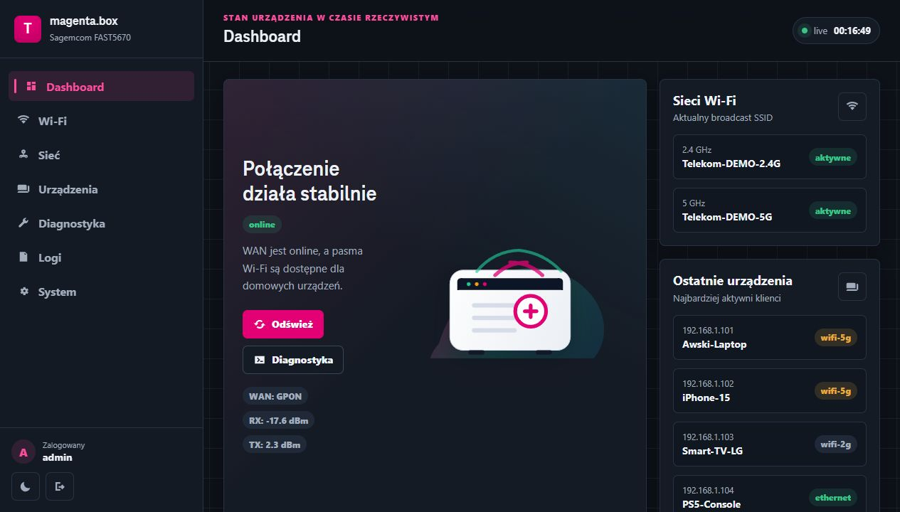
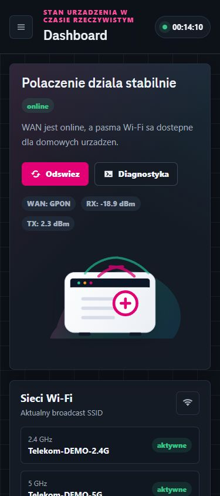

# magenta.box — Telekom Router Demo

Lokalne, w pełni działające demo panelu zarządzania routerem Telekom / T-Mobile (RDK-B / CCSP).
Składa się z trzech warstw:

1. **Oryginalny landing page** (`/`) — niezmieniony frontend z firmware'u operatora (Polska / Czechy / Grecja / …), zasilany mockowanym TR-181-like API.
2. **Nowy panel administracyjny** (`/admin/`) — własny SPA w czystym JS/CSS, motyw Magenta, dark mode, mobile drawer, live update przez SSE.
3. **Dwa wymienne backendy** — lekki stdlib (`mock_server.py`) i pełnoprawny FastAPI (`backend/`) z SQLite, JWT, bcrypt i pub/sub event hub.

| | Landing `/` | Admin `/admin/` |
|---|---|---|
| Frontend | jQuery + tmpl.js (oryginał Telekom) | vanilla JS, custom CSS, TeleNeo |
| Auth | brak (read-only) | login `admin` / `admin`, cookie sesji |
| Live update | polling co 5 s | SSE `/api/stream` (event-hub pub/sub) |
| Mutacja stanu | nie | Wi-Fi, sieć, restart, factory reset |



---

## Spis treści

- [Szybki start](#szybki-start)
- [Wybór backendu](#wybór-backendu)
- [Endpointy API](#endpointy-api)
- [Funkcje panelu admina](#funkcje-panelu-admina)
- [Struktura repozytorium](#struktura-repozytorium)
- [Persystencja stanu](#persystencja-stanu)
- [Rozszerzanie](#rozszerzanie)
- [Znane problemy](#znane-problemy)

---

## Szybki start

### Wariant A — stdlib (zero zależności)

Wystarczy Python 3.10+:

```powershell
python mock_server.py            # port 8000
python mock_server.py 9000       # własny port
```

### Wariant B — FastAPI (pełna baza danych)

```powershell
python -m venv .venv
.\.venv\Scripts\Activate.ps1
pip install -r requirements.txt
uvicorn backend.main:app --reload --port 8000
```

Po starcie (oba warianty) otwórz:

| URL | Co robi |
|---|---|
| <http://127.0.0.1:8000/>          | Landing routera (oryginał Telekom) |
| <http://127.0.0.1:8000/admin/>    | Panel admina — login `admin` / `admin` |
| <http://127.0.0.1:8000/api/stream> | SSE — `event: tick`, `event: logs` |

Przełączanie wariantu krajowego dla landing-page (motyw + branding):

```
?partner=telekom-pl   (domyślny)
?partner=telekom-cz | telekom-sk | telekom-hr | telekom-hu
?partner=telekom-gr   (Cosmote)
?partner=telekom-me | telekom-mk
```

---

## Wybór backendu

| Kryterium | `mock_server.py` (stdlib) | `backend/` (FastAPI) |
|---|---|---|
| Zależności | brak | `requirements.txt` (FastAPI, SQLAlchemy, sse-starlette, passlib, python-jose, …) |
| Persystencja | `state.json` w roocie | SQLite (`router.db` w roocie) |
| Auth | sesja in-memory, token w cookie | JWT (HS256) w cookie HttpOnly + bcrypt |
| Symulator | wątek w tle (`threading`) | async task (`asyncio`) |
| SSE | bezpośrednio w handlerze (per-klient pętla) | `sse-starlette` + `EventHub` (pub/sub do wielu subskrybentów) |
| Diagnostyka (`ping`/`tracert`) | `subprocess.run` blokujący | `asyncio.create_subprocess_exec` |
| Hot-reload | nie | `uvicorn --reload` |

Oba backendy serwują **identyczny** SPA `admin/` i landing `index.html`, więc można je swobodnie podmieniać.

---

## Endpointy API

### Public (landing) — bez autoryzacji

| Method | Path | Zwraca |
|---|---|---|
| GET | `/api/getRouterStatus`    | `partner_id`, `internetStatus`, `wifi_ssid`, `ipAdd`, … |
| GET | `/api/getUpgradeStatus`   | `{ upgradeStatus: false }` |
| GET | `/api/getDeviceInfo`      | model, serial, MAC, firmware, uptime |
| GET | `/api/getNetworkInfo`     | DNS, public IPv4/IPv6, LAN CIDR |
| GET | `/api/getPPPOEInfo`       | `pppoe_status`, alias, `last_status_change` |
| GET | `/api/getWanType`         | GPON/DSL link, sygnały RX/TX, prędkości |
| GET | `/api/getEUTelephoneInfo` | numery telefonów (wariant grecki) |

### Auth

| Method | Path | Body / Effect |
|---|---|---|
| GET  | `/api/auth/me`     | `{ authenticated, user }` |
| POST | `/api/auth/login`  | `{ username, password }` → ustawia cookie `session=` |
| POST | `/api/auth/logout` | usuwa cookie |

### Admin (wymaga sesji)

| Method | Path | Opis |
|---|---|---|
| GET  | `/api/admin/summary`               | snapshot: WAN, Wi-Fi, throughput, devices_count, uptime |
| GET/POST | `/api/admin/wifi`              | konfiguracja 2.4G/5G/guest (SSID, hasło, kanał, on/off) |
| GET/POST | `/api/admin/network`           | LAN IP, maska, zakres DHCP, DNS |
| GET  | `/api/admin/devices`               | lista klientów (driftuje co 2–5 s) |
| GET  | `/api/admin/system`                | model, serial, firmware, MAC, uptime |
| GET  | `/api/admin/logs`                  | ostatnie 200 wpisów |
| POST | `/api/admin/restart`               | resetuje uptime po 6 s |
| POST | `/api/admin/factory_reset`         | dropuje DB / nadpisuje state.json |
| POST | `/api/admin/diagnostics/ping`      | `{ host }` → realny `ping` po stronie serwera |
| POST | `/api/admin/diagnostics/traceroute`| `{ host }` → `tracert` / `traceroute` |

### SSE

`GET /api/stream` — strumień zdarzeń:

```
event: tick
data: { uptime, wan, wifi, throughput, devices_count, system, ts }

event: logs
data: [ { ts, level, msg }, ... ]
```

W FastAPI strumień jest kolejkowany przez `EventHub` (`backend/event_hub.py`) — symulator publikuje raz, wszyscy subskrybenci dostają to samo.

---

## Funkcje panelu admina

| Widok | Co tu jest |
|---|---|
| **Dashboard** | hero z grafiką routera (`router-panel.svg`), 4 kafelki (status WAN, uptime, urządzenia, IPv4), sparkliny RX/TX (30 próbek), pasma Wi-Fi, podgląd top-4 urządzeń |
| **Wi-Fi**    | SSID 2.4/5G, hasło z toggle pokaż/ukryj, wybór kanału, switche on/off (2.4 / 5 / guest), guest SSID |
| **Sieć**     | LAN IP/maska, zakres DHCP, DNS główny/zapasowy |
| **Urządzenia** | tabela 7 kolumn (nazwa, IP, MAC, interfejs, RSSI, RX, TX), auto-odświeżanie co 3 s |
| **Diagnostyka** | input hosta + `Ping` / `Traceroute`, output w terminalu (motyw nocny) |
| **Logi**     | live tail przez SSE, kolory per-level (`info`/`warn`/`error`), auto-scroll, czyszczenie widoku |
| **System**   | info o urządzeniu + akcje serwisowe (restart, factory reset z `confirm()`) |

Dodatkowo:

- **Dark mode** — przełącznik w stopce sidebara, zapisany w `localStorage`.
- **Mobile drawer** — sidebar zamyka się w drawer + scrim poniżej 900 px.
- **Toasty** — `toast()` w prawym dolnym rogu, animacja in/out.
- **XSS-safe** — wszystkie wartości z API trafiają do DOM przez `escapeHTML(...)` (kontrastuje z oryginalnym landingiem, który używa raw ``).
- **Ikony** — pojedyncze inline SVG osadzone w CSS jako `mask-image` (zero zewnętrznych zależności, kolorowane przez `currentColor`).




---

## Struktura repozytorium

```
T-MOBILE/
├── index.html                         # Oryginalny landing routera (Telekom)
├── open_source_license.html           # Modal Open Source
├── restartPopUp.html                  # Modal Restart (idle)
├── restartUpgradePopUp.html           # Modal Restart (during upgrade)
├── resetPopUp.html                    # Modal Factory reset (idle)
├── resetUpgradePopUp.html             # Modal Factory reset (during upgrade)
│
├── CSS/                               # Oryginalne style Telekom
│   ├── bootstrap.min.css
│   ├── common.css
│   ├── style.css
│   └── fonts/                         # TeleNeo Web (Regular / Bold / ExtraBold)
│
├── JS/                                # Oryginalne skrypty Telekom
│   ├── jquery.min.js
│   ├── bootstrap.min.js
│   ├── tmpl.js
│   ├── translator.js
│   ├── utility.js
│   └── index.js
│
├── languages/
│   ├── index.json                     # Lista plików językowych
│   ├── pl.json
│   └── en_pl.json
│
├── admin/                             # Nowy panel administracyjny (SPA)
│   ├── index.html                     # Shell + login screen
│   ├── admin.css                      # Custom CSS (Magenta theme, dark mode, mobile)
│   ├── admin.js                       # Vanilla JS router widoków, SSE client, fetch API
│   └── router-panel.svg               # Grafika hero w dashboardzie
│
├── mock_server.py                     # Backend #1 — stdlib (zero deps)
├── state.json                         # Stan persystowany przez mock_server.py
│
├── backend/                           # Backend #2 — FastAPI (production-ish)
│   ├── main.py                        # FastAPI app, mounty static, SSE endpoint
│   ├── config.py                      # pydantic-settings (.env support)
│   ├── database.py                    # async SQLAlchemy + sessionmaker
│   ├── models.py                      # User, WifiConfig, NetworkConfig, SystemInfo,
│   │                                  # WanStatus, Device, Log
│   ├── schemas.py                     # Pydantic schemas
│   ├── crud.py                        # init_db (seedy), get/update helpers
│   ├── auth.py                        # JWT (HS256) + bcrypt password hashing
│   ├── event_hub.py                   # In-process pub/sub dla SSE
│   ├── simulator.py                   # Async task: drift devices, publish events
│   └── routers/
│       ├── public.py                  # Legacy /api/get* (landing)
│       ├── auth.py                    # /api/auth/{me,login,logout}
│       └── admin.py                   # /api/admin/*
│
├── requirements.txt                   # Dla wariantu B (FastAPI)
├── router.db                          # SQLite — tworzona automatycznie
│
├── admin-dashboard.png                # Zrzuty ekranu (do README)
├── admin-dashboard-view.png
└── admin-mobile-view.png
```

---

## Persystencja stanu

### `mock_server.py`

Stan trzymany w **`state.json`** w roocie. Zapisywany po każdej mutacji. Logi są volatile (resetują się przy restarcie).

### `backend/`

Stan w **`router.db`** (SQLite via aiosqlite). Tabele tworzą się przy starcie (`models.Base.metadata.create_all`). Dane seedowe wstawia `crud.init_db()` (admin user, default Wi-Fi, sieć, system info, WAN, 6 urządzeń).

Reset bazy:

```powershell
Remove-Item router.db
# kolejny start odtworzy schema + seed
```

URL bazy nadpisać przez `.env`:

```
DATABASE_URL=sqlite+aiosqlite:///./other.db
JWT_SECRET=change-me
```

---

## Rozszerzanie

### Dodanie nowego widoku w admin SPA

Edytuj `admin/admin.js`:

1. Dodaj wpis do `viewMeta` (tytuł, podtytuł).
2. Dodaj klucz do obiektu `views` z metodami `render()` (zwraca string HTML) i `onMount()` (po dodaniu do DOM).
3. Dodaj `<button class="nav-item" data-view="...">` w `admin/index.html`.

### Nowy endpoint backendu

- **stdlib**: dopisz `if path == ...` w `Handler.do_GET` lub `do_POST` (`mock_server.py`).
- **FastAPI**: dodaj router-handler w `backend/routers/<plik>.py`, jeśli wymaga sesji to `Depends(get_current_user)`.

### Dodatkowe języki dla landing page

Dorzuć `languages/<lang>.json` i wpisz go do `languages/index.json`. Translator (`JS/translator.js`) załaduje pierwszy pasujący do `navigator.language`.

---


---

## Bezpieczeństwo

To jest **demo do testów lokalnych**, nie produkcja. W szczególności:

- Domyślne hasło `admin` jest hardcoded w `crud.init_db()` / `mock_server.DEFAULT_STATE`.
- `JWT_SECRET` ma fallback `super-secret-key-for-router-demo` — nadpisz przez ENV przed jakimkolwiek wystawieniem na sieć.
- Cookie sesji ma `SameSite=Lax`, `HttpOnly`, ale **bez** `Secure` (bo HTTP localhost).
- Diagnostyka wykonuje realne `ping`/`tracert` po stronie serwera. Whitelist hosta jest minimalna — nie wystawiaj endpointu publicznie.
- CORS nie jest skonfigurowany — backend zakłada same-origin.

Nie nasłuchuje na `0.0.0.0`, tylko `127.0.0.1`. Żeby wystawić poza localhost, zmień bind w `mock_server.py` (`HTTPServer(("0.0.0.0", port), ...)`) lub `uvicorn --host 0.0.0.0`. **Wcześniej** popraw powyższe punkty.

---

## Licencja zasobów stron trzecich

W `index.html` (oryginalny landing) używane są:

- jQuery, Bootstrap 3, JavaScript Templates (`tmpl.js`) — MIT
- TeleNeo Web — własność Deutsche Telekom AG (font dystrybuowany z firmware'em)

Zasoby brand Telekom / Cosmote / Magenta nie są dołączone do tego repo.
